# **프로젝트 : 두루두룹 (DuruDurub)** 👥

<p align="center">
  
</p>

> 관심사가 같은 사람들과 모여 새로운 경험을 만들어가는 **소셜 모임 플랫폼**

<br>

## 📌 시연 영상

[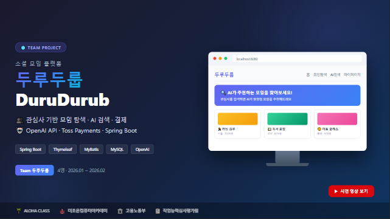](https://www.youtube.com/watch?v=yVU2fAoMcvc)

> ⬆️ 이미지를 클릭하면 시연 영상으로 이동합니다.

<br>

---

## 📋 목차
- [1. 프로젝트 개요](#1-프로젝트-개요)
- [2. 프로젝트 구조](#2-프로젝트-구조)
- [3. 팀 구성 및 역할](#3-팀-구성-및-역할)
- [4. 기술 스택](#4-기술-스택)
- [5. 프로젝트 수행 경과](#5-프로젝트-수행-경과)
- [6. 핵심 기능 코드 리뷰](#6-핵심-기능-코드-리뷰)
- [7. 화면 UI](#7-화면-ui)
- [8. 자체 평가 의견](#8-자체-평가-의견)

---

<br>

## 1. 프로젝트 개요

### 1-1. 프로젝트 주제
- 관심사 기반 소셜 모임 플랫폼 **"두루두룹"**

### 1-2. 주제 선정 배경
- 코로나 이후 오프라인 만남에 대한 수요 증가
- 기존 소셜 플랫폼의 한계점 (카테고리 세분화 부족 등)

### 1-3. 기획 의도
- 누구나 쉽게 관심사 기반 모임을 만들고 참여할 수 있는 플랫폼
- AI 검색을 통한 맞춤형 모임 추천

### 1-4. 활용 방안
- 사용자는 카테고리별로 모임을 탐색하고, AI 검색으로 취향에 맞는 모임을 추천받을 수 있습니다.
- 프리미엄 구독을 통해 무제한 AI 검색 등 부가 기능을 이용할 수 있습니다.

### 1-5. 기대효과
- 오프라인 커뮤니티 활성화
- AI 기반 개인화 추천으로 사용자 만족도 향상

<br>

---

## 2. 프로젝트 구조

### 2-1. 주요 기능
| 구분 | 기능 |
|:---:|:---|
| 👤 사용자 | 회원가입 / 로그인 (Spring Security 세션 인증) |
| 🔍 모임 탐색 | 카테고리별 모임 목록 / 모임 상세 조회 |
| 🤖 AI 검색 | OpenAI API 기반 맞춤형 모임 검색 |
| ❤️ 즐겨찾기 | 관심 모임 좋아요 / 즐겨찾기 목록 관리 |
| 📝 게시판 | 모임 내 게시글 / 댓글 작성 및 좋아요 |
| 🗺️ 지도 | Kakao Maps API 기반 모임 위치 표시 |
| 💳 결제 | Toss Payments 연동 프리미엄 구독 |
| 🎮 미니게임 | 랜덤 미니게임 |
| 🔔 공지사항 | 공지 등록 / 조회 / 수정 / 삭제 |
| 🛡️ 관리자 | 회원 관리 / 모임 관리 / 배너 관리 / 신고 관리 |

### 2-2. 메뉴 구조도
<details>
  <summary>메뉴 구조도 펼치기</summary>
  
  
</details>

<br>

---

## 3. 팀 구성 및 역할

| 이름 | 역할 | 담당 업무 |
|:---:|:---:|:---|
| **안영아** | 팀장 | • 프로젝트 총괄 및 일정 관리<br>• 사용자 및 관리자 페이지 구현 (Thymeleaf)<br>• Spring Security 세션 인증·인가 설정<br>• 프로젝트 깃허브 관리 및 코드 리뷰 |
| **김현수** | 팀원 | • 로그인 / 회원가입 페이지 구현<br>• Spring Security 기반 사용자 권한 부여 및 검증<br>• 각종 정의서 작성 및 검증<br>• 유저 데이터 권한 부여 및 패스 구현 |
| **박희진** | 팀원 | • Figma 화면 설계 및 UI 구성<br>• 카테고리 필터·리스트 구현<br>• 결제 모듈 탑재 및 구현 (토스페이먼츠 API 활용)<br>• Kakao Maps API를 활용한 모임 위치 표시 |
| **최영우** | 팀원 (메인 발표 및 개발) | • AI 검색 기능 (OpenAI API 연동)<br>• REST API 비동기 통신<br>• 데이터전처리 및 정규화, ERD 작성<br>• 게시판 CRUD 및 모임 목록 + 상세보기 페이징 |

> 💡 인원 : **4명** &nbsp;|&nbsp; 기간 : **2026.01 ~ 2026.02**

<br>

---

## 4. 기술 스택

### Frontend
<div align="left">
  
  
  
  
</div>

### Backend
<div align="left">
  
  
  
  
</div>

### Database
<div align="left">
  
</div>

### API / Service
<div align="left">
  
  
  
</div>

### Tools
<div align="left">
  
  
  
  
</div>

### Architecture
```
durudurub/                          ← Spring Boot 메인 서버
├── src/main/java/.../
│   ├── config/                     ← Security, Web 설정
│   ├── controller/                 ← 뷰 & API 컨트롤러
│   ├── dao/                        ← MyBatis Mapper 인터페이스
│   ├── dto/                        ← 데이터 전송 객체
│   ├── security/                   ← Spring Security (세션 인증)
│   └── service/                    ← 비즈니스 로직
├── src/main/resources/
│   ├── mybatis/mapper/             ← SQL 매퍼 XML
│   ├── templates/                  ← Thymeleaf 템플릿 (레이아웃)
│   └── static/                     ← CSS, JS, 이미지
└── uploads/                        ← 업로드 파일 저장소

durudurub-mcp/                      ← Spring AI + MCP 서버
├── src/main/java/.../
│   └── ...                         ← Spring AI (OpenAI) 연동
```

<br>

---

## 5. 프로젝트 수행 경과

### 5-1. 요구사항 & 기능 정의서
<details>
  <summary>요구사항 및 기능 정의서 펼치기</summary>
  
  
  
  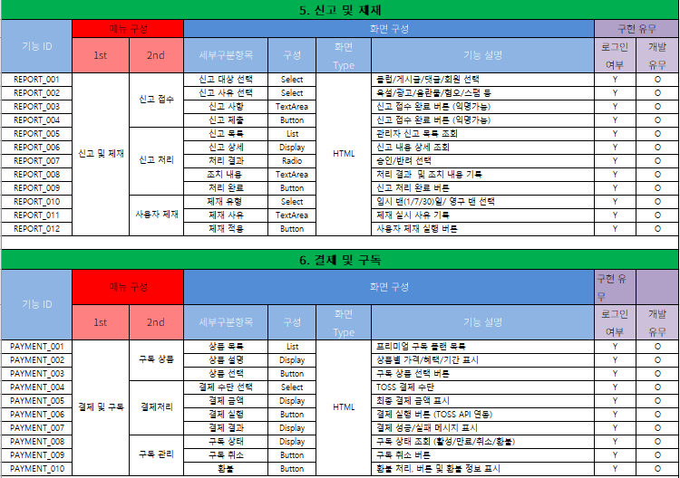
  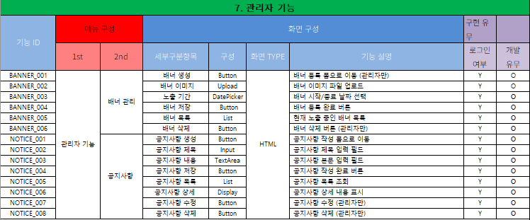
</details>

### 5-2. ERD
<details>
  <summary>ERD 펼치기</summary>
  
  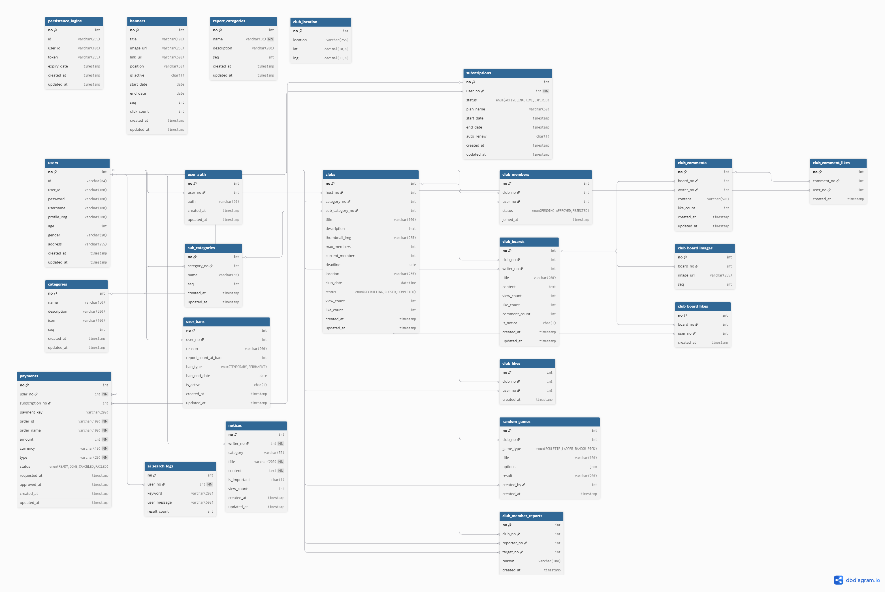
</details>

### 5-3. 활용 장비 및 프로그램
<details>
  <summary>활용 장비 및 프로그램 펼치기</summary>
  
  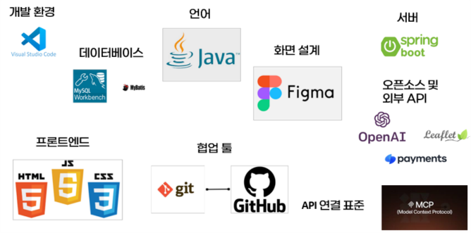
</details>

### 5-4. 플로우 차트
<details>
  <summary>플로우 차트 펼치기</summary>
  
  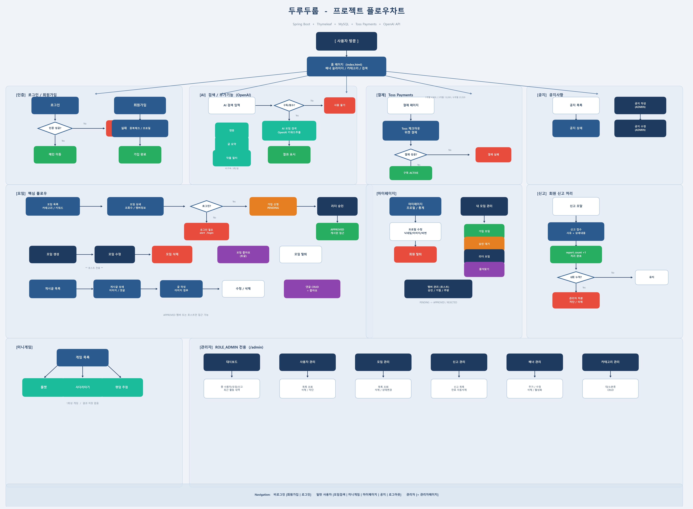
</details>

### 5-5. 간트 차트
<details>
  <summary>간트 차트 펼치기</summary>
  
  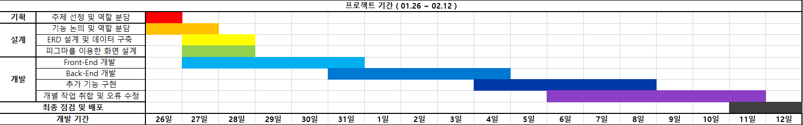
</details>

<br>

---

## 6. 핵심 기능 코드 리뷰

### 6-1. AI 검색 기능 (OpenAI API)
> 사용자의 자연어 검색어를 OpenAI API로 분석하여 맞춤형 모임을 추천합니다.

<details>
  <summary>코드 보기</summary>

```java
// AiSearchController.java 핵심 로직
    /**
     * AI 검색 실행 API
     */
    @PostMapping("/search")
    public ResponseEntity<?> search(@RequestBody Map<String, String> request) {

        Authentication auth = SecurityContextHolder.getContext().getAuthentication();

        boolean loggedIn = auth != null
                && auth.isAuthenticated()
                && !"anonymousUser".equals(auth.getPrincipal());

        if (!loggedIn) {
            return ResponseEntity.status(HttpStatus.UNAUTHORIZED)
                    .body(Map.of("error", "로그인이 필요합니다."));
        }

        User user = userService.selectByUserId(auth.getName());
        boolean isAdmin = auth.getAuthorities().stream()
                .anyMatch(a -> a.getAuthority().equals("ROLE_ADMIN"));

        // 관리자가 아니면 횟수 체크
        if (!isAdmin) {
            // 구독자는 무제한
            Subscription sub = subscriptionService.selectByUserNo(user.getNo());
            boolean isSubscriber = sub != null && "ACTIVE".equals(sub.getStatus());

            if (!isSubscriber) {
                int totalCount = aiSearchLogMapper.countByUserNo(user.getNo());
                if (totalCount >= FREE_LIMIT) {
                    return ResponseEntity.status(HttpStatus.FORBIDDEN)
                            .body(Map.of("error", "무료 검색 횟수를 모두 사용하셨습니다."));
                }
            }
        }

        String userMessage = request.get("message");
        log.info("AI 검색 요청 (user: {}): {}", user.getUserId(), userMessage);

        try {
            AiSearchResponse response = aiSearchService.search(userMessage);

            // 검색 로그 저장 (횟수 차감)
            AiSearchLog searchLog = AiSearchLog.builder()
                    .userNo(user.getNo())
                    .keyword(response.getKeyword())
                    .userMessage(userMessage)
                    .resultCount(response.getClubs() != null ? response.getClubs().size() : 0)
                    .build();
            aiSearchLogMapper.insert(searchLog);

            // 남은 횟수 계산하여 응답에 포함
            if (!isAdmin) {
                Subscription sub2 = subscriptionService.selectByUserNo(user.getNo());
                boolean isSubscriber = sub2 != null && "ACTIVE".equals(sub2.getStatus());
                if (isSubscriber) {
                    response.setRemaining(-1);
                } else {
                    int newTotalCount = aiSearchLogMapper.countByUserNo(user.getNo());
                    int remaining = Math.max(FREE_LIMIT - newTotalCount, 0);
                    response.setRemaining(remaining);
                }
            } else {
                response.setRemaining(-1);
            }

            return ResponseEntity.ok(response);

        } catch (Exception e) {
            log.error("AI 검색 오류: ", e);
            return ResponseEntity.status(HttpStatus.INTERNAL_SERVER_ERROR)
                    .body(Map.of("error", "AI 검색 중 오류가 발생했습니다."));
        }
    }
```
</details>

### 6-2. Spring Security 인증 시스템
> Spring Security + 세션 기반 인증 및 인가 처리

<details>
  <summary>코드 보기</summary>

```java
// SecurityConfig.java 핵심 로직
// CSRF 설정 (API 요청을 위해 일부 경로 제외)
        http.csrf(csrf -> csrf
                .ignoringRequestMatchers("/api/**", "/payments/**", "/confirm/**")
        );

        // ✅ 인가 설정
        http.authorizeHttpRequests(auth -> auth
                                    .requestMatchers("/admin", "/admin/**").hasRole("ADMIN")
                                    .requestMatchers("/club/create", "/club/*/edit", "/club/*/delete").authenticated()
                                    .requestMatchers("/club/*/board/**").authenticated()
                                    .requestMatchers("/users/mypage/**").authenticated()
                                    .requestMatchers("/**").permitAll());

        // 🔐 폼 로그인 설정
        http.formLogin(login -> login
                .loginPage("/login")
                .loginProcessingUrl("/login")
                .usernameParameter("userId")
                .passwordParameter("password")
                .defaultSuccessUrl("/", true)
                .failureUrl("/login?error=true")
                .permitAll()
        );

        // 🚪 로그아웃 설정
        http.logout(logout -> logout
                .logoutUrl("/logout")
                .logoutSuccessUrl("/")
                .invalidateHttpSession(true)
                .deleteCookies("JSESSIONID")
                .permitAll()
        );
```
```java
// 핵심 로직을 보여드리기 위해
// 부득이하게 AiSearchServiceImpl의 
// 프롬프트 및 반복문 구성 전문을 보여드립니다
@Slf4j
@Service
public class AiSearchServiceImpl implements AiSearchService {

    @Autowired
    private ClubMapper clubMapper;

    @Autowired
    private OpenAiService openAiService;

    @Override
    public AiSearchResponse search(String userMessage) throws Exception {

        // 1단계: AI에게 검색 키워드 + 동의어/유사어를 여러 개 추출
        String keywordsRaw = extractKeywords(userMessage);
        log.info("AI가 추출한 키워드들: {}", keywordsRaw);

        // 2단계: 키워드를 분리하여 각각 DB 검색, 중복 제거하며 합산
        String[] keywords = keywordsRaw.split("[,\\s]+");
        Set<Integer> foundClubNos = new HashSet<>();
        List<Club> clubs = new ArrayList<>();

        for (String kw : keywords) {
            String trimmed = kw.trim();
            if (trimmed.isEmpty()) continue;
            try {
                List<Club> result = clubMapper.search(trimmed);
                for (Club club : result) {
                    if (foundClubNos.add(club.getNo())) {
                        clubs.add(club);
                    }
                }
            } catch (Exception e) {
                log.warn("키워드 '{}' 검색 중 오류: {}", trimmed, e.getMessage());
            }
        }
        log.info("다중 키워드 검색 결과: {}건 (키워드 {}개)", clubs.size(), keywords.length);

        // 3단계: 검색 결과가 없으면 → 전체 모임을 AI에게 주고 추천
        List<Club> allClubs = null;
        if (clubs.isEmpty()) {
            log.info("키워드 검색 결과 없음 → 전체 모임 대상 AI 추천");
            allClubs = clubMapper.list();
        }

        // 4단계: AI 추천 메시지 생성
        String aiMessage = generateRecommendation(userMessage, clubs, allClubs);

        // 5단계: 검색 결과 없었지만 AI가 전체 모임에서 골라준 경우, 해당 모임 결과에 포함
        if (clubs.isEmpty() && allClubs != null && !allClubs.isEmpty()) {
            clubs = findMentionedClubs(aiMessage, allClubs);
        }

        // 대표 키워드
        String displayKeyword = keywords.length > 0 ? keywords[0].trim() : keywordsRaw;

        // 키워드 검색으로 직접 매칭된 결과가 있었는지 여부
        boolean isExactMatch = (allClubs == null);

        return AiSearchResponse.builder()
                .aiMessage(aiMessage)
                .clubs(clubs)
                .keyword(displayKeyword)
                .exactMatch(isExactMatch)
                .build();
    }

    /**
     * 키워드 추출 - 유사어/동의어까지 포함하여 여러 개 반환
     */
    private String extractKeywords(String userMessage) throws Exception {
        String systemPrompt =
            "너는 모임 플랫폼의 검색 키워드 추출 전문가야.\n" +
            "사용자의 메시지에서 모임을 검색하는 데 사용할 키워드들을 추출해줘.\n\n" +
            "## 규칙\n" +
            "1. 핵심 키워드 1~2개 + 그 동의어/유사어/관련어를 최대 5개까지 추출\n" +
            "2. 쉼표(,)로 구분해서 출력\n" +
            "3. 키워드만 출력해. 다른 설명 없이\n" +
            "4. 구어체/줄임말은 정식 명칭으로도 변환해서 포함해\n" +
            "5. 위치 정보가 있으면 포함해\n\n" +
            "## 예시\n" +
            "- '서울에서 등산 같이 할 사람?' → '등산, 산, 하이킹, 트레킹, 서울'\n" +
            "- '먹는거 좋아하는데' → '음식, 맛집, 요리, 쿠킹, 미식, 먹방'\n" +
            "- '나 mbti intp인데 추천해줘' → 'INTP, MBTI, 성격, 심리, 토론, 독서'\n" +
            "- '코딩 배우고 싶어' → '코딩, 프로그래밍, 개발, IT, 스터디'\n" +
            "- '카드놀이 좋아해' → '카드, 보드게임, 게임, 놀이, 카드게임'\n" +
            "- '운동 좀 하고 싶다' → '운동, 헬스, 피트니스, 스포츠, 러닝, 요가'";

        return openAiService.call(systemPrompt, userMessage, 100, 0.3);
    }

    /**
     * AI 추천 메시지 생성
     * - 검색 결과가 있으면 → 검색 결과 기반 추천
     * - 검색 결과가 없으면 → 전체 모임 데이터를 보고 가장 관련 있는 것 추천
     */
    private String generateRecommendation(String userMessage, List<Club> searchResults, List<Club> allClubs) throws Exception {
        StringBuilder clubInfo = new StringBuilder();

        if (!searchResults.isEmpty()) {
            // 검색 결과가 있는 경우
            for (Club club : searchResults) {
                String desc = club.getDescription() != null
                    ? club.getDescription().substring(0, Math.min(club.getDescription().length(), 60))
                    : "";
                clubInfo.append(String.format("- [%d] %s | %s | %s | %d/%d명 | %s\n",
                    club.getNo(), club.getTitle(),
                    club.getCategory() != null ? club.getCategory().getName() : "",
                    club.getLocation() != null ? club.getLocation() : "",
                    club.getCurrentMembers(), club.getMaxMembers(),
                    desc));
            }

            String systemPrompt =
                "너는 '두루두룹' 모임 플랫폼의 친근한 AI 추천 도우미 '두루'야.\n\n" +
                "## 규칙\n" +
                "1. 아래 검색 결과 중에서 사용자에게 가장 잘 맞는 모임을 추천해줘\n" +
                "2. 왜 이 모임이 어울리는지 이유를 친근하게 설명해줘\n" +
                "3. 이모지를 적절히 사용해서 친근하게 답변해줘\n" +
                "4. 3~5줄 정도로 답변해줘\n\n" +
                "[검색된 모임 목록]\n" + clubInfo.toString();

            return openAiService.call(systemPrompt, userMessage, 500, 0.8);

        } else if (allClubs != null && !allClubs.isEmpty()) {
            // 검색 결과가 없지만 전체 모임은 있는 경우 → AI가 직접 골라 추천
            int limit = Math.min(allClubs.size(), 40);
            for (int i = 0; i < limit; i++) {
                Club club = allClubs.get(i);
                String desc = club.getDescription() != null
                    ? club.getDescription().substring(0, Math.min(club.getDescription().length(), 60))
                    : "";
                clubInfo.append(String.format("- [%d] %s | %s | %s | %d/%d명 | %s\n",
                    club.getNo(), club.getTitle(),
                    club.getCategory() != null ? club.getCategory().getName() : "",
                    club.getLocation() != null ? club.getLocation() : "",
                    club.getCurrentMembers(), club.getMaxMembers(),
                    desc));
            }

            String systemPrompt =
                "너는 '두루두룹' 모임 플랫폼의 친근한 AI 추천 도우미 '두루'야.\n\n" +
                "## 상황\n" +
                "사용자의 질문에 정확히 매칭되는 모임은 없었어.\n" +
                "하지만 아래 전체 모임 목록 중에서 사용자의 관심사와 가장 가까운 모임을 찾아서 추천해줘.\n\n" +
                "## 규칙\n" +
                "1. 사용자의 관심사를 파악하고, 그에 가까운 모임 1~3개를 골라서 추천해\n" +
                "2. 정확히 일치하지 않더라도 관련될 수 있는 모임을 창의적으로 연결해서 추천해\n" +
                "3. '정확히 원하시는 모임은 아직 없지만, 이런 모임은 어떠세요?' 같은 톤으로\n" +
                "4. 추천할 모임의 제목을 정확히 언급해줘 (목록에서 골라)\n" +
                "5. 정말 관련 모임이 없으면 직접 모임을 만들어보라고 안내해줘\n" +
                "6. 이모지를 적절히 사용해서 친근하게 4~6줄로 답변해줘\n\n" +
                "[현재 운영 중인 전체 모임 목록]\n" + clubInfo.toString();

            return openAiService.call(systemPrompt, userMessage, 600, 0.85);

        } else {
            return "😅 아직 등록된 모임이 없어요! 관심 있는 모임을 직접 만들어보시는 건 어떨까요?";
        }
    }

    /**
     * AI 추천 메시지에서 언급된 모임을 전체 목록에서 찾아 반환
     */
    private List<Club> findMentionedClubs(String aiMessage, List<Club> allClubs) {
        List<Club> mentioned = new ArrayList<>();
        if (aiMessage == null || allClubs == null) return mentioned;

        for (Club club : allClubs) {
            if (club.getTitle() != null && aiMessage.contains(club.getTitle())) {
                mentioned.add(club);
                if (mentioned.size() >= 5) break;
            }
        }
        return mentioned;
    }
}
```
</details>

### 6-3. Toss Payments 결제 연동
> 프리미엄 구독을 위한 결제 시스템

<details>
  <summary>코드 보기</summary>

```java
// PaymentController.java 핵심 로직
// 결제 승인 (Toss confirm)
	@PostMapping("/confirm/payment")
	@ResponseBody
	public ResponseEntity<Map<String, Object>> confirmPayment(@RequestBody Map<String, Object> payload) {
		String paymentKey = String.valueOf(payload.get("paymentKey"));
		String orderId = String.valueOf(payload.get("orderId"));
		String amount = String.valueOf(payload.get("amount"));

		if (paymentKey == null || orderId == null || amount == null) {
			Map<String, Object> error = new HashMap<>();
			error.put("code", "INVALID_REQUEST");
			error.put("message", "paymentKey/orderId/amount is required");
			return ResponseEntity.status(HttpStatus.BAD_REQUEST).body(error);
		}

		int amountValue;
		try {
			amountValue = Integer.parseInt(amount);
		} catch (NumberFormatException e) {
			Map<String, Object> error = new HashMap<>();
			error.put("code", "INVALID_AMOUNT");
			error.put("message", "amount must be number");
			return ResponseEntity.status(HttpStatus.BAD_REQUEST).body(error);
		}

		Payment payment = paymentService.selectByOrderId(orderId);
		if (payment == null) {
			Map<String, Object> error = new HashMap<>();
			error.put("code", "ORDER_NOT_FOUND");
			error.put("message", "order not found");
			return ResponseEntity.status(HttpStatus.NOT_FOUND).body(error);
		}

		if (payment.getAmount() != amountValue) {
			Map<String, Object> error = new HashMap<>();
			error.put("code", "AMOUNT_MISMATCH");
			error.put("message", "amount mismatch");
			return ResponseEntity.status(HttpStatus.BAD_REQUEST).body(error);
		}

		// TODO: Toss Payments 승인 API 호출
		log.info("confirmPayment payload: paymentKey={}, orderId={}, amount={}", paymentKey, orderId, amount);
		paymentService.markApproved(orderId, paymentKey);

		int periodMonths = resolvePeriodByAmount(amountValue);
		if (periodMonths <= 0) {
			Map<String, Object> error = new HashMap<>();
			error.put("code", "INVALID_PERIOD");
			error.put("message", "unsupported amount");
			return ResponseEntity.status(HttpStatus.BAD_REQUEST).body(error);
		}
		subscriptionService.activateSubscription(payment.getUserNo(), periodMonths);

		Map<String, Object> response = new HashMap<>();
		response.put("status", "DONE");
		response.put("paymentKey", paymentKey);
		response.put("orderId", orderId);
		response.put("amount", amountValue);
		return ResponseEntity.ok(response);
	}
```
</details>

<!-- 필요한 만큼 핵심 기능 추가 -->

<br>

---

## 7. 화면 UI

### 메인 화면
<details>
  <summary>메인 화면 보기</summary>
  
  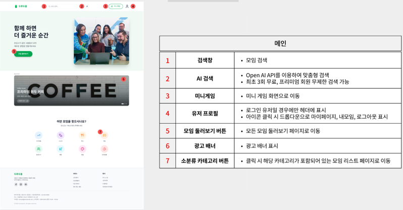
</details>
<br>

### 모임 탐색 (Explore)
<details>
  <summary>모임 탐색 화면 보기</summary>
  
  
</details>
<br>

### 모임 상세
<details>
  <summary>모임 상세 화면 보기</summary>
  
  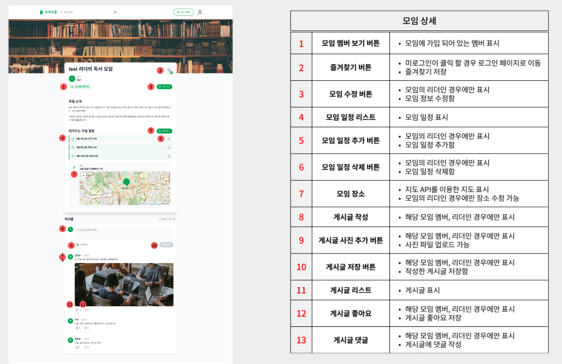<br>
  
</details>
<br>

### AI 검색
<details>
  <summary>AI 검색 화면 보기</summary>
  
  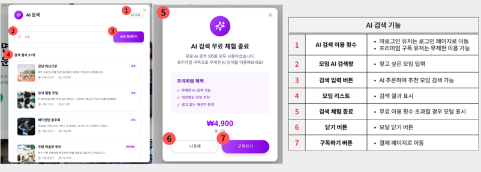
</details>
<br>

### 로그인 / 회원가입
<details>
  <summary>로그인 / 회원가입 화면 보기</summary>
  
  <br>
  <br>
  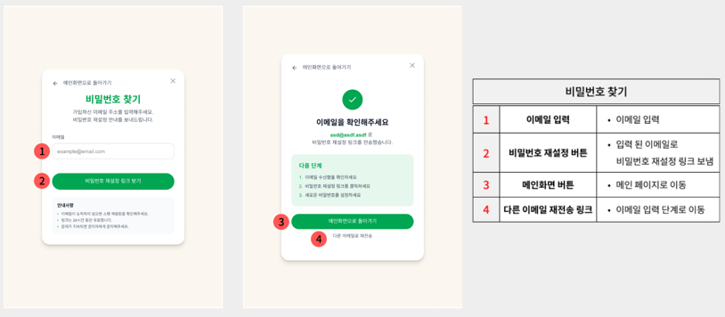
</details>
<br>

### 마이페이지
<details>
  <summary>마이페이지 화면 보기</summary>
  
  <br>
  <br>
  <br>
  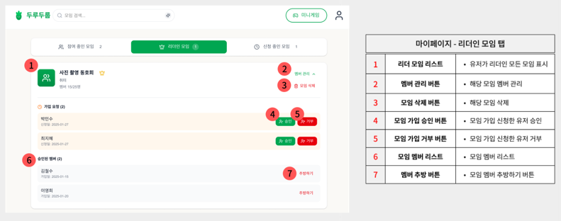<br>
  
</details>
<br>

### 결제 (구독)
<details>
  <summary>결제 화면 보기</summary>
  
  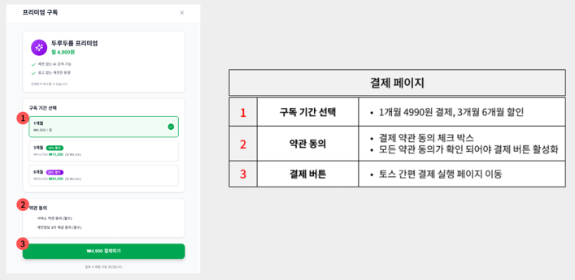
</details>
<br>

### 공지사항 페이지
<details>
  <summary>공지사항 페이지 화면 보기</summary>
  
  <br>
  <br>
  
</details>

### 관리자 페이지
<details>
  <summary>관리자 페이지 화면 보기</summary>
  
  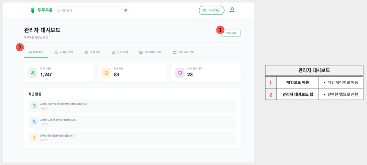<br>
  <br>
  <br>
  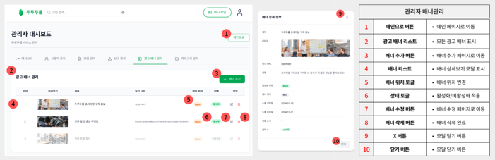
</details>
<br>

<br>

---

## 8. 자체 평가 의견

### 8-1. 개별 평가

**안영아**
> - MVC 구조에 대한 전반적인 시스템을 이번 프로젝트에 적용하여 흐름에 대한 이해도를 높였으며, Thymeleaf 템플릿 엔진과 Spring Security 세션 인증을 중점으로 서버 사이드 렌더링 기반 웹 서비스를 구현할 수 있었습니다.
> - 팀장으로서 프로젝트 일정 관리와 깃허브 관리를 병행하며 협업 역량을 키울 수 있었습니다.

**김현수**
> - Spring Boot 기반으로 회원가입, 로그인 기능과 권한 부여 구조를 직접 구현했으며, Security 설정 과정에서 시행착오를 겪었지만 계층 구조를 명확히 분리하며 좀 더 안정적으로 구조를 설계할 수 있었습니다.
> - 이를 통해 보안 흐름과 사용자 처리 로직에 대한 이해·공부를 더 하게 되었으며, 문제 해결 능력과 백엔드 설계 역량을 한 단계 더 끌어올릴 수 있었습니다.

**박희진**
> - 결제 시스템을 처음 구현하며 결제 방식부터 요청, 응답 프로세스까지의 전체적인 흐름을 알게 되었습니다.
> - TossPayments API 연동과 Figma 기반 UI 설계를 통해 프론트엔드 구현 역량을 키울 수 있었고, 외부 API 통합의 경험을 쌓을 수 있었습니다.

**최영우**

 - AI 검색 기능을 OpenAI API와 연동하여 구현한 것이 가장 큰 성과였습니다.
 - Thymeleaf Layout Dialect를 활용한 레이아웃 상속 구조와, Spring Security의 인가 설정·CSRF 예외 처리 등 보안 흐름을 실무 수준으로 익혔습니다.
 - MyBatis 매퍼 XML로 동적 쿼리를 작성하고 페이징 처리를 구현하면서, 서버 사이드 데이터 처리 흐름을 체계적으로 이해하게 되었습니다.

### 8-2. 종합 평가

**잘된 점**
- Thymeleaf Layout Dialect를 활용한 레이아웃 상속 구조로 서버 사이드 렌더링 기반의 일관된 UI 구현
- Spring Security 세션 인증·인가 체계를 도입하고, CSRF 예외 처리 등 보안 정책을 실무 수준으로 적용
- OpenAI API를 연동한 AI 검색 기능으로 사용자 자연어 기반 맞춤형 모임 추천 구현
- MyBatis 매퍼 XML을 활용한 동적 쿼리 작성과 서버 사이드 페이징 처리로 데이터 처리 효율화
- Toss Payments 결제 연동, Kakao Maps API 지도 표시 등 다양한 외부 API 통합 경험 확보
- ERD 설계부터 구현까지 팀원 간 역할 분담을 명확히 하여 효율적인 협업 달성

**한계점**
- 시간 부족으로 AI 검색에 Spring AI MCP 기반 agentic 구조를 온전히 활용하지 못함
- 결제 모듈이 Toss Payments 테스트 키로만 동작하여 실제 결제·환불·구독 갱신 프로세스 미완성
- Thymeleaf의 서버 사이드 렌더링 특성상 동적 UI 구현에 한계가 있어 JavaScript 코드가 복잡해짐
- Spring Security 세션 기반 인증의 확장성 한계 (Stateless JWT 전환 필요성 인식)
- 단위·통합 테스트 코드 부재로 기능 변경 시 사이드이펙트 검증이 어려움

**개선점**
- Spring AI MCP를 활용한 AI 검색 agentic 구조 고도화로 더 정확한 모임 추천 제공
- 프론트엔드를 React SPA로 분리하여 프론트/백 독립 개발 구조 확립 → **2차 리팩토링에서 달성**
- 실제 결제 API 키 적용 및 결제 프로세스(환불·구독 갱신 등) 완성
- JWT 기반 Stateless 인증 체계 도입으로 확장성 확보 → **2차 리팩토링에서 달성**
- 테스트 코드 작성 및 CI/CD 파이프라인 구축으로 배포 자동화

---

<br>